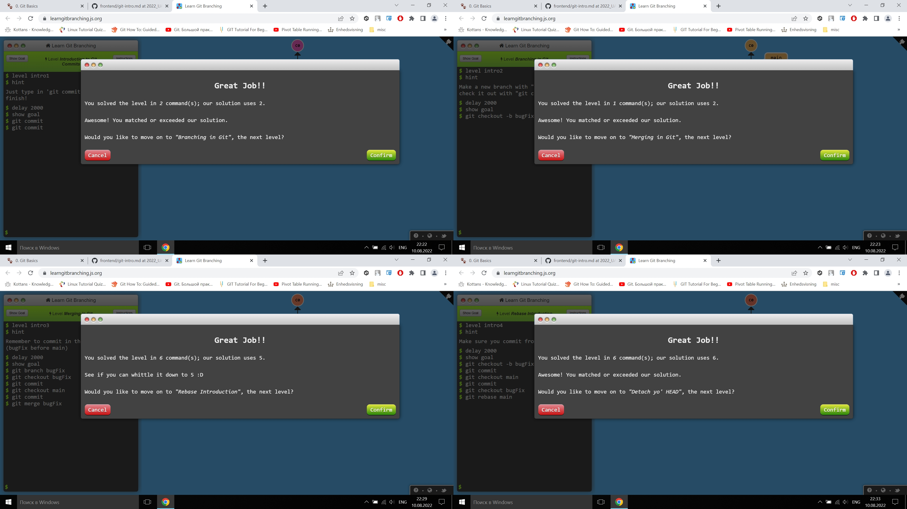
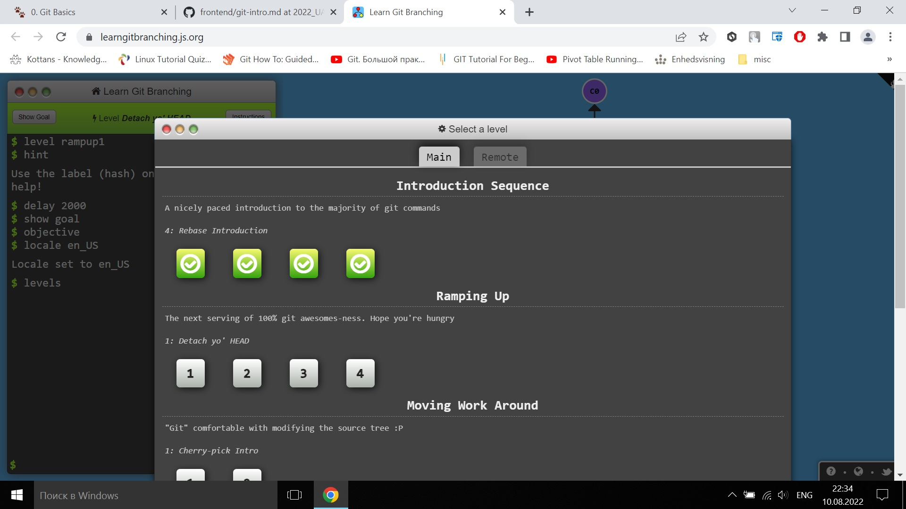
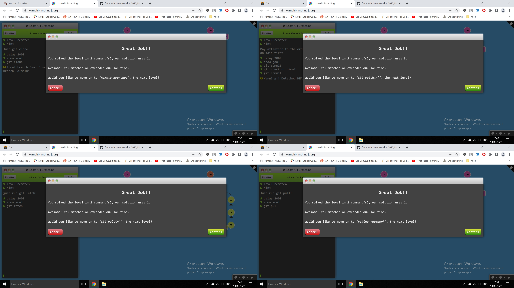
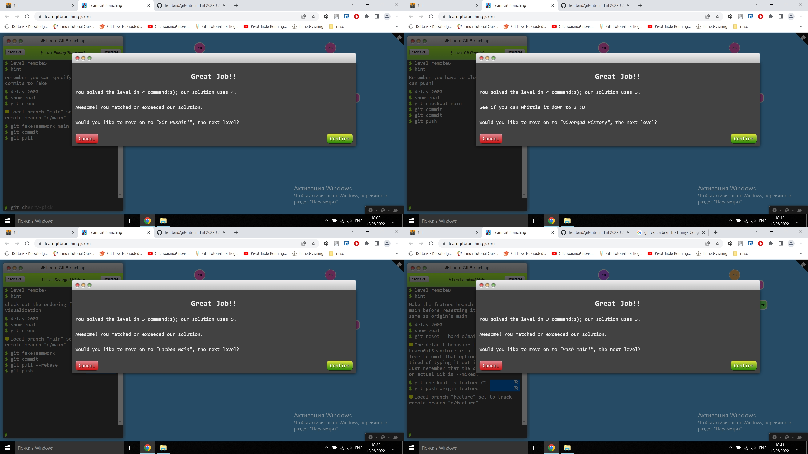
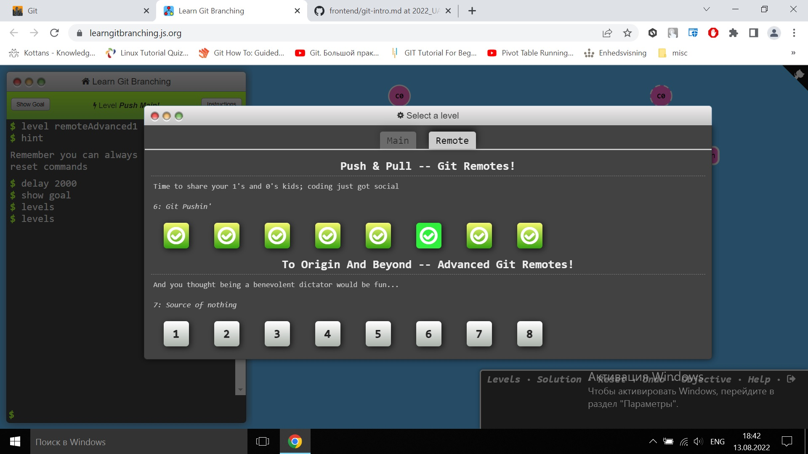

# kottans-frontend :blue_heart::yellow_heart:

## 0. Git Basics. Git та GitHub

```linux
git config --global user.name "julia-online"
```
---------------------------------------------------------------------

- Git thinks about its data like a **stream of snapshots**.

- Git has three main states where the local files can reside: **modified, staged, and committed**.

- Git uses **HEAD** as the symbolic name for the currently checked out commit.
---------------------------------------------------------------------

As you can see in the screenshots below, learngitbranching.js.org is completed. :point_down:










